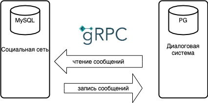

# Разделение монолита на сервисы

Приложение соцсети реализует функционал - регистрации, авторизации, добавления друзей, добавление постов + формирование ленты новостей. <br>
Весь функционал реализован в монолите для работы которого необходимы бд(MySQL/Tarantool/Redis), очередь (RabbitMQ).<br> 
В данном задании была добавлена диалоговая система. <br>
Упрощенная схема приложения представлена на рисунке: <br>


Диалоговая система реализует следующий функционал: 
* записать сообщение 
* отдать диалог

Для хранения данных сервис использует собственную бд. <br>
Сервис представляет собой grpc сервер - описание в протофайле ```/api/proto/dialog.proto```. <br>
Монолит является клиентом и запись сообщений, загрузка диалогов происходит через вызов ручек диалогового сервиса через grpc.
